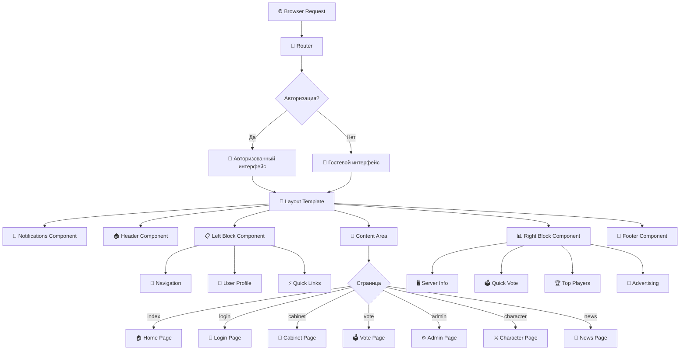
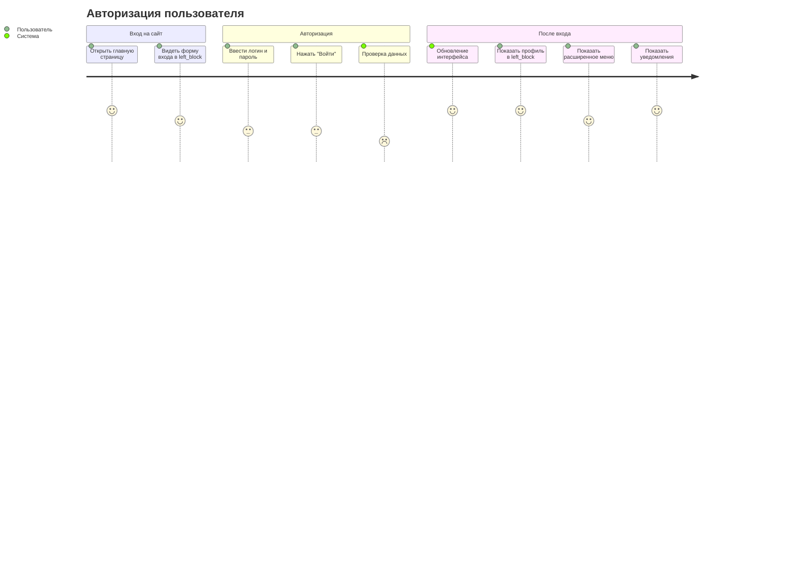
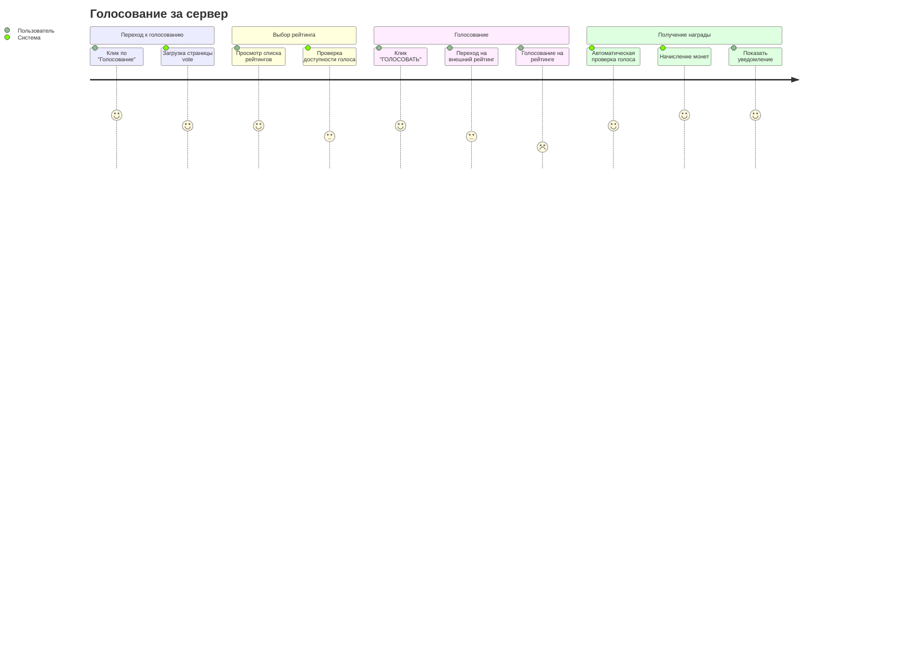
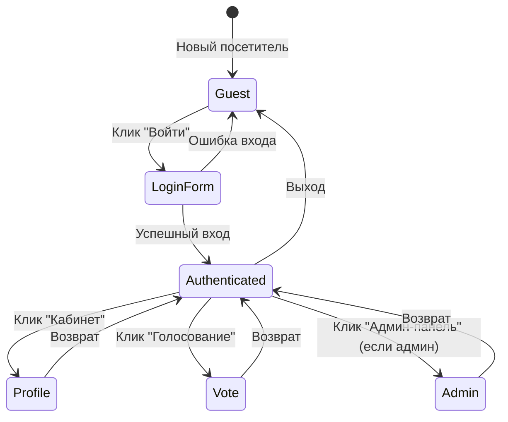

# Архитектура интерфейса AnotherWoW

## Схема компонентов



## Пользовательские потоки (User Flow)

### Поток авторизации


### Поток голосования


## Адаптивная сетка

### Desktop Layout (1200px+)
```
┌─────────────────────────────────────────────────┐
│                NOTIFICATIONS                    │
├─────────────────────────────────────────────────┤
│                    HEADER                       │
├──────────────┬──────────────────┬───────────────┤
│  LEFT BLOCK  │   MAIN CONTENT   │  RIGHT BLOCK  │
│   (200px)    │    (flexible)    │   (200px)     │
│              │                  │               │
│              │                  │               │
│              │                  │               │
└──────────────┴──────────────────┴───────────────┘
│                    FOOTER                       │
└─────────────────────────────────────────────────┘
```

### Tablet Layout (768px - 1199px)
```
┌─────────────────────────────────────────────────┐
│                NOTIFICATIONS                    │
├─────────────────────────────────────────────────┤
│                    HEADER                       │
├─────────────────────────────────────────────────┤
│              MAIN CONTENT                       │
│                                                 │
├──────────────┬──────────────────────────────────┤
│  LEFT BLOCK  │          RIGHT BLOCK             │
│              │                                  │
└──────────────┴──────────────────────────────────┘
│                    FOOTER                       │
└─────────────────────────────────────────────────┘
```

### Mobile Layout (< 768px)
```
┌─────────────────────────────────────────────────┐
│                NOTIFICATIONS                    │
├─────────────────────────────────────────────────┤
│   [☰] HEADER (collapsed menu)                   │
├─────────────────────────────────────────────────┤
│                                                 │
│              MAIN CONTENT                       │
│                                                 │
├─────────────────────────────────────────────────┤
│              LEFT BLOCK                         │
├─────────────────────────────────────────────────┤
│              RIGHT BLOCK                        │
├─────────────────────────────────────────────────┤
│                   FOOTER                        │
└─────────────────────────────────────────────────┘
```

## Состояния интерфейса

### State Management


## Компоненты и их взаимодействие

### Структура данных компонентов

#### Header Component
```php
// Данные для header.html.php
$headerData = [
    'userInfo' => [
        'username' => 'PlayerName',
        'balance' => 150,
        'isAdmin' => false
    ],
    'navigation' => [
        ['url' => '/', 'label' => 'Главная', 'icon' => '🏠'],
        ['url' => '/cabinet', 'label' => 'Кабинет', 'icon' => '👤'],
        ['url' => '/vote', 'label' => 'Голосование', 'icon' => '🗳️']
    ]
];
```

#### Left Block Component
```php
// Данные для left_block.html.php
$leftBlockData = [
    'isAuthenticated' => true,
    'navigation' => $navigationItems,
    'userProfile' => [
        'username' => 'PlayerName',
        'balance' => 150,
        'avatar' => '/images/avatars/default.png'
    ],
    'quickLinks' => [
        ['url' => '/download', 'label' => 'Скачать клиент'],
        ['url' => '/forum', 'label' => 'Форум'],
        ['url' => '/support', 'label' => 'Поддержка']
    ]
];
```

#### Right Block Component
```php
// Данные для right_block.html.php
$rightBlockData = [
    'serverInfo' => [
        'status' => 'online',
        'playersOnline' => 245,
        'uptime' => '99%'
    ],
    'voteServices' => [
        [
            'name' => 'MMOTOP',
            'reward' => 1,
            'available' => true,
            'url' => 'https://mmotop.ru/vote/...'
        ]
    ],
    'topPlayers' => [
        ['name' => 'PlayerOne', 'level' => 80],
        ['name' => 'PlayerTwo', 'level' => 79]
    ]
];
```

## API Endpoints для компонентов

### Ajax-запросы
```javascript
// Получение уведомлений
GET /api/notifications
Response: {
    "notifications": [
        {
            "id": 123,
            "type": "vote_reward",
            "message": "Получена 1 монета за голосование",
            "timestamp": "2025-09-27 15:30:00"
        }
    ]
}

// Скрытие уведомления  
POST /api/notifications/hide
Body: {"notification_id": 123}

// Быстрое голосование
POST /api/vote/quick
Body: {"service": "mmotop"}
Response: {
    "success": true,
    "redirect_url": "https://mmotop.ru/vote/...",
    "message": "Переход к голосованию"
}

// Получение онлайна сервера
GET /api/server/status
Response: {
    "status": "online",
    "players_online": 245,
    "uptime_percent": 99
}
```

## CSS Framework Structure

### Основные классы
```css
/* Layout */
.main-layout { display: grid; }
.left-block, .right-block { width: 200px; }
.content-area { flex: 1; }

/* Components */
.block { border: 1px solid #555; margin: 10px 0; }
.nav-item { display: block; padding: 5px 10px; }
.btn { padding: 8px 15px; background: #0066cc; }

/* States */
.vote-available { background: #1a4d1a; }
.vote-cooldown { background: #4d1a1a; }
.server-online { color: #00ff00; }
.server-offline { color: #ff0000; }

/* Responsive */
@media (max-width: 768px) {
    .main-layout { grid-template-columns: 1fr; }
}
```

Этот wireframe представляет полную архитектуру интерфейса проекта AnotherWoW с учетом всех технических особенностей и пользовательских сценариев.